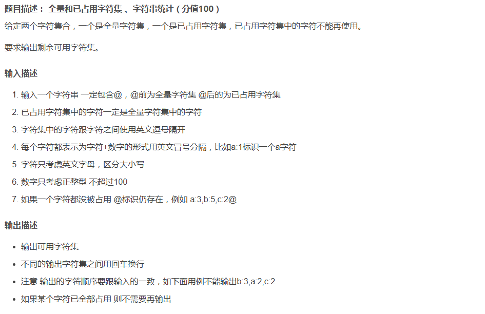
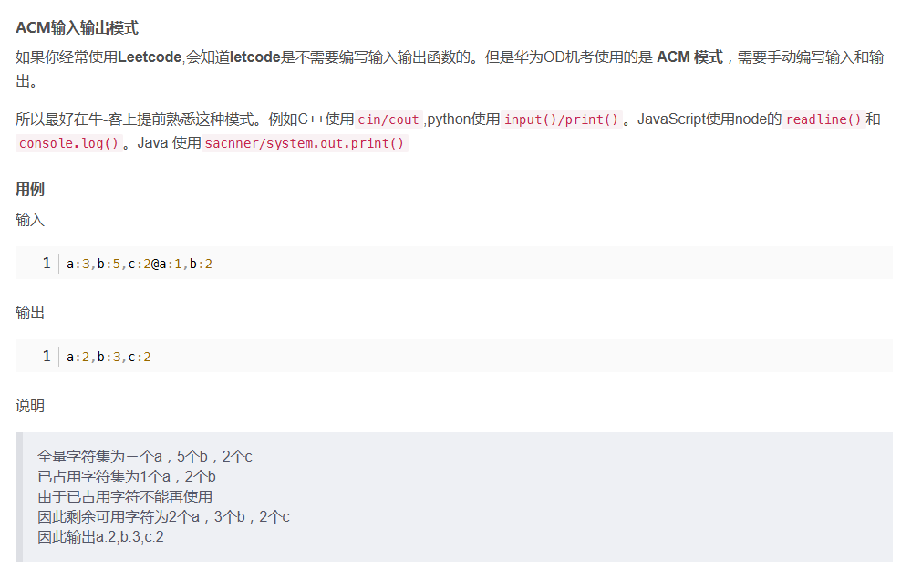

```javascript
const readline = require('readline');

const rl = readline.createInterface({
  input: process.stdin,
  output: process.stdout
});

rl.on('line', (input) => {
  // 将输入字符串按照@符号分割为全量字符集和已占用字符集
  const splitInput = input.split("@");
  const fullCharacterSet = splitInput[0]; // 全量字符集
  const occupiedCharacterSet = splitInput[1]; // 已占用字符集

  // 创建字符列表，用于存储全量字符集中的字符及其对应的数量
  const characterList = [];

  // 将全量字符集按照逗号分割为单个字符
  const fullCharacterSetSplit = fullCharacterSet.split(",");

  // 遍历全量字符集的每个字符
  for (const character of fullCharacterSetSplit) {
    // 将字符按照冒号分割为字符和数量
    const characterSplit = character.split(":");
    characterList.push(characterSplit); // 将字符和数量添加到字符列表中
  }

  // 如果已占用字符集为空，则输出全量字符集
  if (occupiedCharacterSet === "") {
    console.log(fullCharacterSet + "@");
    process.exit(0);
  }

  // 创建已占用字符集的哈希表，用于存储已占用字符及其对应的数量
  const occupiedCharacters = {};

  // 将已占用字符集按照逗号分割为单个字符
  const occupiedCharacterSetSplit = occupiedCharacterSet.split(",");

  // 遍历已占用字符集的每个字符
  for (const character of occupiedCharacterSetSplit) {
    // 将字符按照冒号分割为字符和数量
    const characterSplit = character.split(":");
    occupiedCharacters[characterSplit[0]] = parseInt(characterSplit[1]); // 将字符和数量添加到已占用字符集的哈希表中
  }

  // 遍历字符列表中的每个字符
  for (let i = 0; i < characterList.length; i++) {
    const character = characterList[i];
    // 如果已占用字符集中包含当前字符
    if (character[0] in occupiedCharacters) {
      const count = parseInt(character[1]) - occupiedCharacters[character[0]]; // 计算剩余可用数量
      if (count > 0) {
        character[1] = count.toString(); // 更新字符列表中的数量为剩余可用数量
      } else {
        characterList.splice(i, 1); // 如果剩余可用数量为0，则移除当前字符
        i--; // 由于移除了一个字符，需要将索引减1
      }
    }
  }

  // 构建输出字符串
  let result = "";
  for (const character of characterList) {
    result += character[0] + ":" + character[1] + ","; // 将每个字符及其数量添加到输出字符串中
  }
  result = result.slice(0, -1); // 删除最后一个逗号
  console.log(result); // 输出结果

  rl.close();
});
```