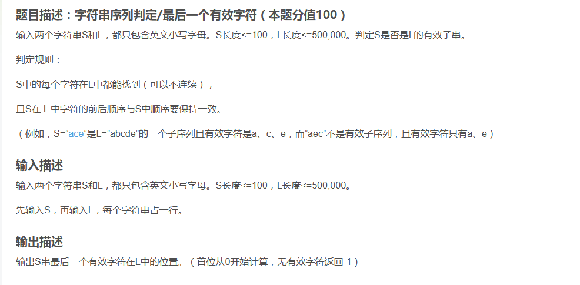
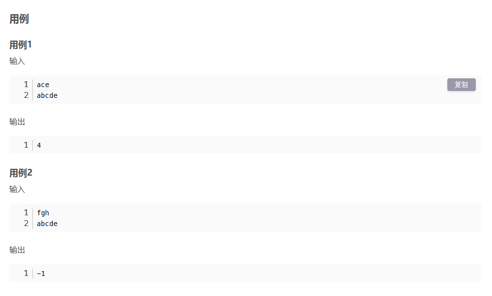
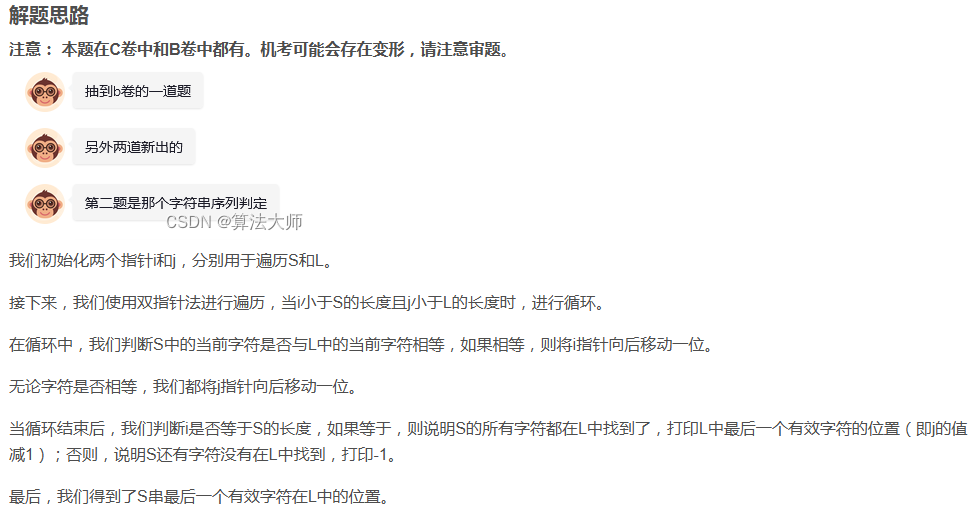

```javascript
const readline = require('readline');

// 创建一个readline接口对象来读取用户的输入
const rl = readline.createInterface({
  input: process.stdin,
  output: process.stdout
});

// 读取第一个字符串S
rl.on('line', (stringS) => {
  // 读取第二个字符串L
  rl.on('line', (stringL) => {
    // 初始化两个索引，分别用于遍历S和L
    let indexS = 0;
    let indexL = 0;

    // 当S和L都没有遍历完时，继续遍历
    while (indexS < stringS.length && indexL < stringL.length) {
      // 如果S中的当前字符与L中的当前字符相同，则S的索引加1
      if (stringS.charAt(indexS) === stringL.charAt(indexL)) {
        indexS++;
      }
      // 无论字符是否相同，L的索引都加1
      indexL++;
    }

    // 如果S的所有字符都在L中找到了（即S已经遍历完了），则打印L中最后一个有效字符的位置（即L的当前索引减1）
    if (indexS === stringS.length) console.log(indexL - 1);
    // 如果S还有字符没有在L中找到，则打印-1
    else console.log(-1);

    rl.close();
  });
});
```