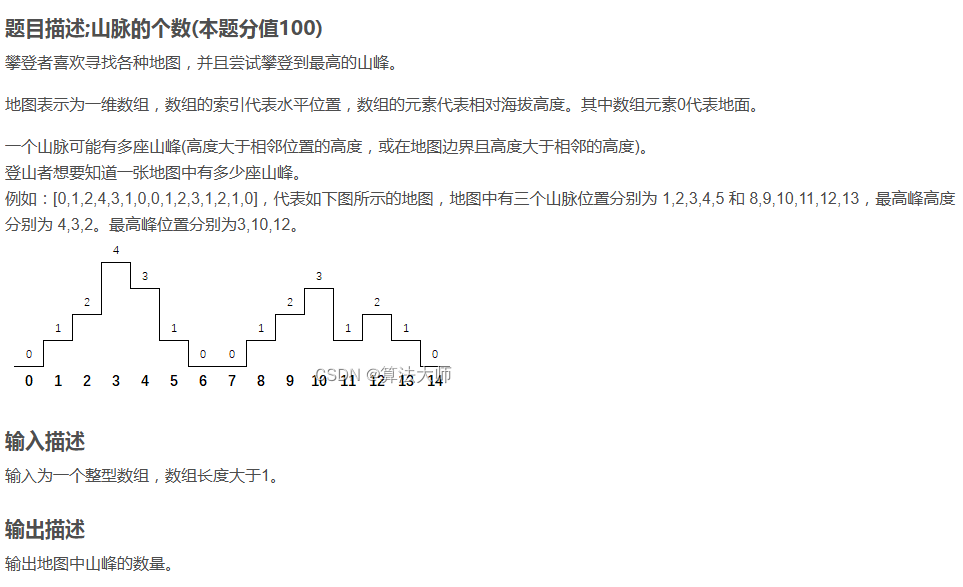
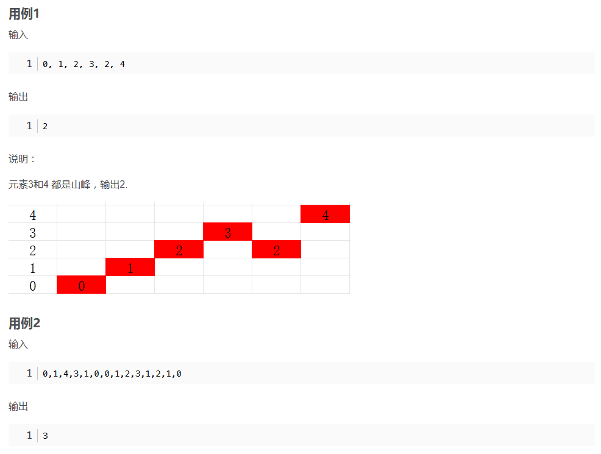
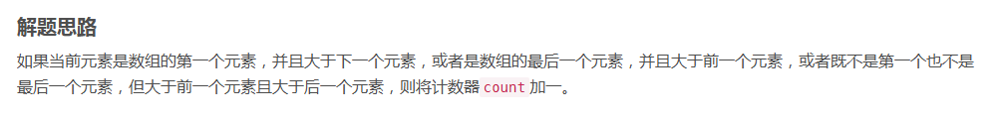

```javascript
function count_peaks(hill_map) {
    let count = 0; // 初始化计数器为 0
    for(let i = 0; i < hill_map.length; i++){ // 遍历数组 hill_map
        if(i === 0 && hill_map[i] > hill_map[i+1]){ // 如果当前位置在数组的开头，并且当前元素大于下一个元素
            count++; // 计数器加一
        }
        if(i === hill_map.length-1 && hill_map[i] > hill_map[i-1]){ // 如果当前位置在数组的末尾，并且当前元素大于前一个元素
            count++; // 计数器加一
        }
        if(i > 0 && i < hill_map.length-1 && hill_map[i] > hill_map[i-1] && hill_map[i] > hill_map[i+1]){ // 如果当前位置不在开头和末尾，并且当前元素大于前一个元素且大于后一个元素
            count++; // 计数器加一
        }
    }
    return count; // 返回计数器的值作为结果
}

```

```javascript

const readline = require('readline');

// 创建 readline 接口实例
const rl = readline.createInterface({
  input: process.stdin,
  output: process.stdout
});

 

// 读取一行输入
rl.on('line', (input) => {
  // 使用逗号分割输入字符串
  const numberStrings = input.split(",");
  
  // 将字符串数组转换为整型数组
  const hill_map = numberStrings.map(num => parseInt(num.trim(), 10));

  let count = 0; // 初始化计数器为 0
  for (let i = 0; i < hill_map.length; i++) { // 遍历数组 hill_map
    if (i === 0 && hill_map[i] > hill_map[i + 1] || // 如果当前位置在数组的开头，并且当前元素大于下一个元素
        i === hill_map.length - 1 && hill_map[i] > hill_map[i - 1] || // 如果当前位置在数组的末尾，并且当前元素大于前一个元素
        i > 0 && i < hill_map.length - 1 && hill_map[i] > hill_map[i - 1] && hill_map[i] > hill_map[i + 1]) { // 如果当前位置不在开头和末尾，并且当前元素大于前一个元素且大于后一个元素
      count++; // 计数器加一
    }
  }

  console.log(count); // 输出计数器的值
  rl.close(); // 关闭 readline 接口
});

```