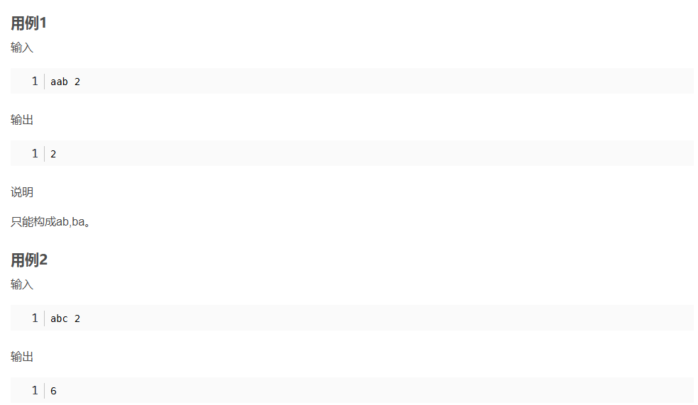
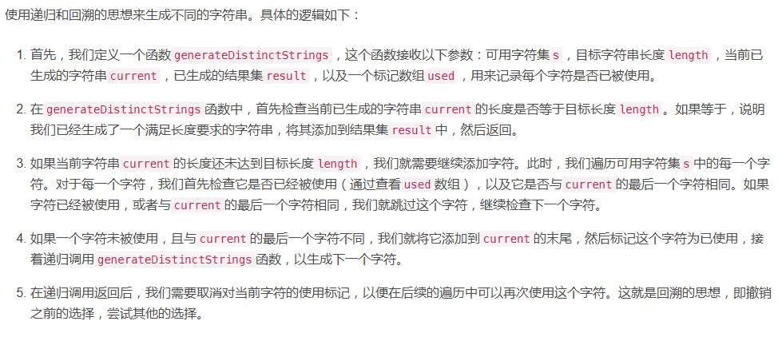

```javascript
// 导入所需的模块
const readline = require('readline');

// 创建一个接口来读取用户的输入
const rl = readline.createInterface({
  input: process.stdin,
  output: process.stdout
});

// 递归生成满足条件的不同字符串
function generateDistinctStrings(str, length, current, set, used) {
  // 当生成的字符串长度等于指定长度时，将其加入到集合中
  if (current.length === length) {
    set.add(current);
    return;
  }

  // 遍历字符串中的字符
  for (let i = 0; i < str.length; i++) {
    // 判断字符是否已经被使用，或者当前字符与前一个字符相同
    if (used[i] || (current.length > 0 && current.charAt(current.length - 1) === str.charAt(i))) {
      continue; // 如果字符已被使用或与前一个字符相同，则跳过当前字符
    }
    used[i] = true; // 标记当前字符为已使用
    // 递归调用生成下一个字符
    generateDistinctStrings(str, length, current + str.charAt(i), set, used);
    used[i] = false; // 取消标记当前字符的使用状态，以便下一次遍历
  }
}

// 计算满足条件的不同字符串的数量
function countDistinctStrings(str, length) {
  // 创建一个集合来存储不同的字符串
  const set = new Set();
  // 创建一个数组来标记字符串中的字符是否已经被使用
  const used = new Array(str.length).fill(false);
  // 调用generateDistinctStrings方法生成满足条件的不同字符串
  generateDistinctStrings(str, length, "", set, used);
  // 打印生成的所有不同的字符串
  // for (let string of set) {
    // console.log(string);
  // }
  // 返回不同字符串的数量
  return set.size;
}

// 读取用户输入的字符串
rl.on('line', (input) => {
  // 将输入的字符串按空格分割为两部分，分别为字符串和长度
  const parts = input.split(" ");
  const str = parts[0]; // 获取输入的字符串
  const length = parseInt(parts[1]); // 将输入的长度部分转换为整数

  // 调用countDistinctStrings方法计算满足条件的不同字符串的数量
  const count = countDistinctStrings(str, length);
  // 输出计算结果
  console.log(count);

  rl.close();
});


```