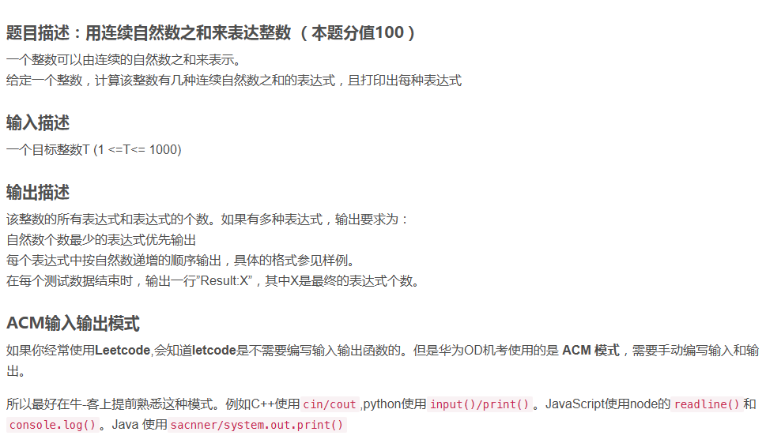
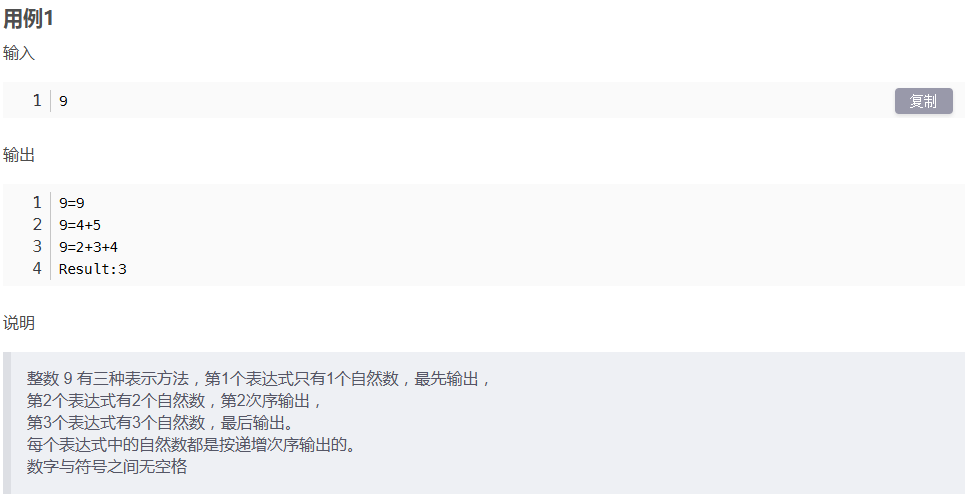
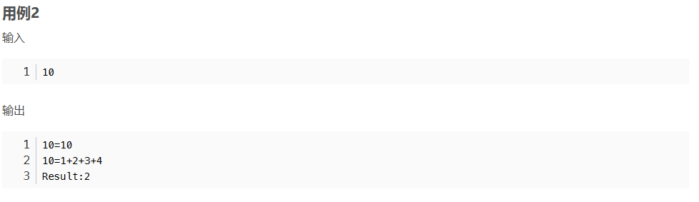
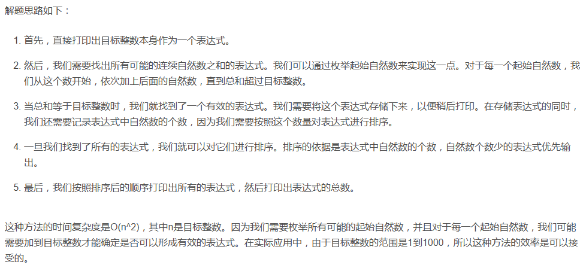

```javascript
const readline = require('readline');

const rl = readline.createInterface({
  input: process.stdin,
  output: process.stdout
});

// 提示用户输入目标整数
rl.on('line', (target) => {
  target = parseInt(target);  // 将输入的字符串转换为整数
  console.log(`${target}=${target}`);
  
  let expressions = [];  // 存储所有满足条件的表达式

  // 遍历所有可能的起始自然数
  for (let i = 1; i < target; i++) {
    let sum = 0;
    let expression = '';

    // 从i开始累加，直到sum大于或等于target
    for (let j = i; sum < target; j++) {
      sum += j;
      expression += `${j}+`;  // 向表达式中添加自然数和加号

      // 当累加和等于目标整数时，将表达式存储到数组中
      if (sum === target) {
        expressions.push(expression.slice(0, -1));  // 去掉表达式末尾的加号
        break;
      }
    }
  }

  // 自定义比较函数，用于按表达式中自然数的个数进行排序
  expressions.sort((a, b) => {
    let aCount = a.split('+').length;
    let bCount = b.split('+').length;
    return aCount - bCount;
  });

  // 输出所有满足条件的表达式
  expressions.forEach(expression => {
    console.log(`${target}=${expression}`);
  });

  // 输出满足条件的表达式个数
  console.log(`Result: ${expressions.length + 1}`);

  rl.close();
});

```